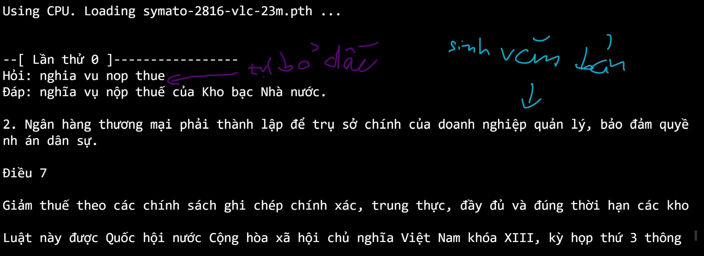

Tham gia thảo luận tại https://discord.gg/NuYwhH6Kbb

# TODOs

## Thử nghiệm với dữ liệu nhỏ (DONE)
- [x] Tìm cách tokenize hợp với tiếng việt (xem [symato](#symato))
  1. Âm tiết là đặc trưng chính của tiếng Việt và là đơn vị hợp lý để sử dụng trong việc phân tích ngôn ngữ.
  2. Việc phân tách âm tiết thành các đơn vị như sym, mark và tone giúp giảm số lượng đơn vị cần sử dụng.
  3. Bộ vocab 3k tokens là đủ để encode hiệu quả mọi corpus có hàm lượng tiếng Việt lớn, và việc sử dụng 256 bytes để encode phần còn lại cũng sẽ hoạt động tốt.
- [x] Đọc hiểu rwkv ([xem rwkv.md](./docs/rwkv.md) hoặc [bản rút gọn](./docs/rwkv-illustrated.md))
- [x] Viết lại rwkv inference engine [~200 loc in python](https://github.com/telexyz/symato/blob/1854f26d097ea616f8f76c054d0357f739d7c92c/model_run_f32.py)
- [x] Đọc hiểu và rút gọn [code training](./rwkv-v4neo)
- [x] rwkv-lm với dataset âm tiết tiếng Việt bất kỳ
  - [x] Thiết kế symato vocab
  - [x] Tạo mini dataset [vlc.xyz](https://raw.githubusercontent.com/telexyz/data/master/vlc.xyz) (16MB)
  - [x] Huấn luyện symato-2816-vlc-23m
  - [x] Chạy symato-2816-vlc-23m `./run.sh`
  - [x] Cải tiến Symato tknz giảm token space giữa 2 âm tiết
  - [x] __Tăng context length 2x => loss giảm 1/2 trong 10 epochs đầu__

## Thử nghiệm với dữ liệu đủ lớn
- [x] Thu thập và xử lý 100G dữ liệu: [xem vi project](https://github.com/telexyz/vi)

- [ ] Train mô hình có độ lớn phù hợp với dữ liệu sau khi đã lọc và cân bằng
  - [x] Xây dựng symato_16k (vs sentencepiece 16k)
  - [x] Xây dựng cách lấy mẫu để đảm bảo mỗi token chỉ đc train 1 lần (tiết kiệm computing)
  - [ ] Huấn luyện mô hình 2.5 tỉ tham số trên 36G dữ liệu chọn lọc

## Low-level
- [ ] Tích hợp bộ phân tích ngữ âm từ zig vào python để có thể tknz trực tiếp từ Python code
- [ ] Viết lại inference engine bằng zig

- - -

https://user-images.githubusercontent.com/8133/216773986-3d26d73a-9206-45b1-ae8f-d5d8fdb01199.mp4

### Symato có thể làm hai việc một lúc, tự động thêm dấu thanh và sinh văn bản


- - -

> Symato là viết tắt của Symbol + Mark + Tone. Google translate sang tiếng Việt là "Đồng Cảm"

# Giới thiệu

__Đây nơi thiết lập các thử nghiệm xây dựng [mô hình văn bản rất to](./docs/MHVBRT.md) với bộ dữ liệu càng thuần Việt càng tốt, tập trung vào âm tiết tiếng Việt, để làm nhẹ bộ tham số và làm nổi bật đặc trưng của tiếng Việt__. Và trả lời các câu hỏi dưới đây:

- Liệu có thể lặp lại scaling law chỉ với một lượng dữ liệu và tính toán hạn chế? (xem cramming paper)

- Liệu có thể lặp lại scaling law chỉ với một tác vụ nhỏ trong xử lý ngôn ngữ? (xem santacoder)

- Các cách khác nhau để khai thác mô hình mà chưa cần fine-tune?

- Các cách khác nhau để tăng độ hiệu quả của một mô hình? (tiếp tục pre-train, fine-tune cho từng tác vụ, RLHL ...)

- Bao nhiêu lượng dữ liệu là đủ để pre-train tiếp một mô hình đang có cho một ngôn ngữ lạ?

- Với một lượng dữ liệu nhất định, của một lĩnh vực cụ thể thì nên tokenization như thế nào? Bao nhiêu params / training bao lâu là đủ?

- - -

## Tại sao lại RWKV chứ không phải Transformer?
[RWKV](./docs/rwkv.md) là một mô hình rất thú vị, nó vừa mang tính chất của GPT tức là huấn luyện song song được như Transformer, vừa mang tính chất của RNN chỉ cần trạng thái ẩn ở bước t để tính toán trạng thái hệ thống ở bước t+1. Vì thế nó tiết kiệm tính toán, bộ nhớ hơn rất nhiều so với Transformer. Việc này giúp huấn luyện nhanh, triển khai dễ dàng, thậm chí chạy tốt trên smartphone. RWKV đã được huấn luyện từ 1B tới 14B params trên tập ngữ liệu The Pile và có độ tốt tương đương các mô hình transformer khác. Các lợi thế này có thể không có ích với các tập đoàn lớn như Google, Microsoft (cung cấp hệ thống cho OpenAI) bởi họ có dư sức mạnh tính toán và lượng dữ liệu khổng lồ. Nhưng với lượng tính toán có hạn (ví dụ một máy tính mạnh trang bị 8 GPUs) và lượng dữ liệu hạn chế như tiếng Việt thì RWKV có thể làm nên sự khác biệt.

## Tại sao cần pre-train cho riêng tiếng Việt?

Các mô hình ngôn ngữ lớn hiện nay bị thống trị bởi tiếng Anh và các ngôn ngữ gốc La-tinh, ngôn ngữ Việt do dữ liệu ít và đặc trưng riêng (các ký tự utf-8 mã hóa 2-4 bytes) nên khi tokenization sẽ trở nên lép vế (xem hình dưới). Từ đấy dẫn tới thiệt hại về cả hiệu suất và kinh tế (nhiều tokens / words thì sinh câu chậm hơn, tốn tài nguyên hơn)


Minh họa trên cho thấy cùng một đoạn văn có độ dài tương đương, số lượng tokens tiếng Việt nhiều gấp 4 lần tiếng Anh. Hệ quả là độ dài ngữ cảnh giảm đi 1/4, tốc độ sinh dữ liệu chậm đi 4 lần và nếu tính tiền theo token thì tiếng Việt cũng bị tính nhiều hơn 4 lần so với tiếng Anh.

Nguyên nhân là do bộ tokenization của chatgpt được tối ưu cho tiếng Anh và các ngôn ngữ La-tinh, vì thế nó không hiểu được nhiều mã unicode tiếng Việt (được encode bằng 2-4 bytes), cụ thể ký tự "ữ" trong "ngôn ngữ" bị tokenized thành 3 bytes (thể hiện bằng 3 dấu ??? ở minh họa trên). Tuy cách tokenize rất bất lợi cho tiếng Việt, cộng thêm lượng dữ liệu huấn luyện bị lép vế so với tiếng Anh nhưng kết quả chatgpt vẫn rất ấn tượng với tiếng Việt (video dưới).


https://user-images.githubusercontent.com/8133/215305323-4d776242-d8fe-497e-96f5-9c95f344b992.mp4

Video cho thấy tốc độ sinh dữ liệu cho tiếng Việt chậm hơn rất nhiều so với tiếng Anh do nó sinh từng ký tự một thậm chí từng byte một cho tiếng Việt. Còn với tiếng Anh nó chủ yếu sinh theo từ. Tuy bất lợi như vậy nhưng mô hình vẫn đủ mạnh mẽ để lưu trữ các thông tin tiếng Việt và tìm ra câu trả lời hợp lý. Điều đó cho thấy sức mạnh rất to lớn của mô hình ngôn ngữ, và chatgpt là ứng dụng đầu tiên đưa sức mạnh đó tới tay người dùng một cách dễ chịu. Hay nói cách khác chatgpt xây dựng được giao diện hợp lý để người dung khai thác sức mạnh của mô hình ngôn ngữ lớn. (Lưu ý: câu trả lời của chatGPT về âm tiết tiếng Việt là chưa chính xác hoàn toàn).

## Symato
__Cách tokenization nào hợp với tiếng Việt?__

Tknz là cách bẻ text thành các đơn vị thông tin để đưa vào xử lý. Tknz cần cân bằng giữa 1/ số lượng vocab (unique tokens), 2/ độ phủ thông tin của tokens và 3/ tính linh hoạt của mô hình:
- Số lượng vocab lớn làm tăng params và chậm mô hình. Số lượng vocab nhỏ, thì độ phủ thông tin thấp
- Độ phủ thông tin thấp nhưng tính linh hoạt cao và ngược lại độ phủ thông tin cao thì tính linh hoạt giảm đi. Ví dụ có thể xử lý những từ chưa gặp trong bộ huấn luyện miễn là nó có thể cấu thành từ vocab đang có. Cách biển diễn linh hoạt nhất là dùng 256-bytes làm vocab, vì mọi dữ liệu bất kỳ đều có thể biểu diễn bằng một chuỗi bytes.
- Độ phủ thông tin thấp dẫn đến mô hình khó học cách biển diễn thông tin hơn và tốc độ xử lý chậm hơn vì tốc độ xử lý từng token là như nhau mà độ phủ thấp dẫn đến cần (rất) nhiều tokens mới trình bày được thông tin cần triết xuất.
- Độ phủ thông tin cao dẫn tới việc biểu diễn tốt hơn và ngữ cảnh (số lượng tokens) mô hình có thể kiểm soát dài hơn.
- BPE (byte-pair-encoding) là một cách tự động cân bằng giữa vocab_size, độ phủ thông tin và tính linh hoạt của mô hình bằng cách định nghĩa cho nó bộ symbols cơ bản nhất (thường là 256-bytes hoặc unicode chars) và max vocab_size, từ đó nó sẽ tìm cách nhóm các symbols đang có lại để có độ phủ thông tin cao nhất mà không vượt quá max vocab_size
- Vì có sự overlap giữa các tokens nên một câu có thể tknz theo nhiều cách, để giữ được tính linh hoạt của mô hình, ta có thể __huấn luyện nó với các cách tknz khác nhau__.


Âm tiết tiếng Việt chiếm ~80% trong text corpus, nó chính là đặc trưng của cả tiếng nói và chữ viết Việt. Dùng âm tiết làm đơn vị là hợp lý. Tiếng Việt viết ~16K âm tiết có ý nghĩa, 12K âm tiết thường dùng, khi phân tách ra thành cách viết không dấu (sym) + dấu (mark) và thanh điệu (tone) thì số lượng đơn vị giảm đi đáng kể. Chỉ còn khoảng 2500 sym và 18 marktone. Như vậy với 2560 tokens là có thể cover hết được sym + marktone và còn thêm các token khác để biểu thị viết hoa vs viết thường...

__Bộ vocab 3k tokens__ (khoảng 2800 tokens để encode thuần tiếng Việt + 256 tokens tương đương với 256 bytes để biểu diễn mọi thứ còn lại) là có thể tokenization hiệu quả mọi corpus có hàm lượng tiếng Việt lớn. Nhắc lại ví dụ trên khi chatgpt tokenize tiếng Việt dưới dạng chars và bytes để encode 80% corpus tiếng Việt mà vẫn cho ra kết quả ấn tượng, thì việc dùng 256 bytes để encode 20% phần còn lại chắc chắn sẽ hoạt động tốt.

### Tại sao không dùng bộ vocab lớn hơn?
Hoàn toàn có thể mở rộng vocabs lên nữa khi cần, nhưng việc giới hạn bộ vocabs nhỏ sẽ giúp tiết kiệm số lượng tham số và làm tăng tốc độ của mô hình. Tôi tin rằng bộ vocab như vậy là đủ tốt cho những tài nguyên tiếng Việt hiện có (xem giải thích ở trên và thêm thống kê bên dưới).

[Thống kê gần 1Gb text](https://github.com/telexyz/results#readme) trộn từ facebook comments, news titles, viet opensub, wikipedia, sách, truyện được:

=> số lượng tokens không phải tiếng Việt và là 1 ký tự chiếm tới 18%, số tokens này dùng 256-bytes để encode là vô cùng hợp lý. Số lượng ít ỏi tokens không phải tiếng Việt còn lại dùng 256-bytes để encode cũng không ảnh hưởng nhiều tới hiệu năng mô hình.

### Có thể mở rộng bộ vocab được không?
Hoàn toàn có thể mở rộng bộ vocab bằng cách giữ nguyên symato và cho thêm vào các token dài hơn ví dụ 16k âm tiết chẳng hạn. Khi mở rộng như vậy mỗi câu tiếng Việt có thể có nhiều cách tokenization ta có thể huấn luyện trên nhiều cách tknz như vậy. Khi decode tùy từng tác vụ ta ưu tiên các cách tknz khác nhau. Ví dụ thêm dấu thanh thì dùng symato, còn sinh câu thì ưu tiên dùng tokens dài (âm tiết, từ ...)

### Tôi chưa hiểu bạn giải thích rõ hơn được không?
Tóm lại symato có 3 bộ vocabs:
1. `symato-3k` gồm 256 bytes, 18 marktones, khoảng 2800 syms (âm tiết viết không dấu viết thường) và các tokens bổ trợ
2. `symato-16k` gồm bộ từ vựng `symato-3k` cộng thêm khoảng 13k đơn âm tiết và đôi âm tiết tiếng Việt có dấu viết xuất hiện thường xuyên nhất trong dữ liệu huấn luyện (unigram và bigram)
3. `symato-32k` gồm bộ từ vựng `symato-16k` cộng thêm các bigrams và trigrams ... 
4. `symato+` gồm symato-3k,16k,32k và các tokens khác xây dựng bằng BPE để cover các dữ liệu phi âm tiết tốt hơn.

Ví dụ về bigrams trong symato-16k xây dựng cho dataset văn bản luật.
```
 Quy hoạch hệ_thống quảng_cáo trực_quan ngoài_trời, bảo_đảm sự thống_nhất, đồng_bộ, tạo cơ_sở pháp_lý thuận_lợi cho các đơn_vị, doanh_nghiệp, các tổ_chức, cá_nhân thực_hiện tốt nhiệm_vụ tuyên_truyền, quảng_cáo ngoài_trời theo đúng quy_định, góp_phần phục_vụ đắc_lực công_tác tuyên_truyền các nhiệm_vụ chính_trị của tỉnh; góp_phần thúc_đẩy phát_triển sản_xuất, lưu_thông hàng_hóa, phục_vụ dân_sinh; đồng_thời tạo cảnh_quan đẹp cho các đô_thị và quảng_bá phát_triển du_lịch.
 Xác định cụ_thể vị_trí đất_đai, không_gian sử_dụng, quy_mô, hình_thức và nội_dung của các cụm bảng quảng_cáo trên các tuyến quốc_lộ, vị_trí treo băng zôn, trạm bảng tin, quảng_cáo rao vặt và các hình_thức quảng_cáo ngoài_trời khác; trên_cơ sở đó trình cấp có thẩm_quyền giao quyền sử_dụng đất, hoặc cho_thuê đất sử_dụng lâu_dài, phù_hợp với quy_hoạch chung, quy_hoạch vùng, lĩnh_vực và quy_mô phát_triển đô_thị; không phá_vỡ kiến_trúc cảnh_quan và không_gian đô_thị, đáp_ứng nhu_cầu giao_lưu, hội_nhập và phát_triển; tiếp_cận và áp_dụng công_nghệ quảng_cáo tiên_tiến hiện_đại, tương_xứng và phù_hợp với thực_tiễn phát_triển kinh_tế xã_hội của tỉnh, phù_hợp với đặc_điểm dân_cư, phong_tục, tập_quán của từng địa_phương.
 2. Mục tiêu cụ_thể:
 2.1. Xây dựng hệ_thống bảng cổ_động trực_quan: 
 Giai đoạn 2011 2015:
 Rà soát hệ_thống bảng cổ_động trực_quan, băng zôn, trạm bảng tin, bảng hộp đèn trên cột điện và dải phân_cách các hình_thức quảng_cáo ngoài_trời khác, phục_vụ công_tác tuyên_truyền đã có ở các trung_tâm ( thành_phố, thị_xã, thị_trấn, thị_tứ...) để điều_chỉnh cho phù_hợp với Quy hoạch.
 Xây dựng mới hệ_thống bảng cổ_động trực_quan ở trung_tâm thành_phố Thanh_hóa dọc Đại lộ Lê Lợi, đường Quốc lộ 1 A phần đi_qua thành_phố Thanh_hóa, Khu đô_thị mới phía Đông, phía Tây và từ cửa ô của thành_phố đi trung_tâm các huyện, thị_xã.
 Xây dựng hệ_thống bảng hộp đèn trên dải phân_cách và trên cột điện tại trục đường Đại lộ Lê Lợi và tuyến Quốc lộ 1 A đi_qua thành_phố Thanh_hóa.
 Xây dựng các bảng cổ_động trực_quan, trạm bảng tin, theo các đường chính của cấp xã, phường, thôn, khu dân_cư.
```

### vocab_size ảnh hưởng tới mô hình như thế nào?

Dưới đây là 2 mô hình có kiến trúc giống nhau, chỉ khác nhau ở bộ từ vựng (vocab), mô hình đầu dùng tokenizer PhoBert vocab_size ~64k, mô hình sau dùng tokenizer Symato vocab_size 2816. vocab_size lớn làm phình emb và head lên rất rất nhiều. Khiến số params của blocks chính phải thu lại còn 1/3 để mô hình có thể chạy được trên RTX3050ti 4G VRAM. Mặc dù số lượng params đã tăng lên gấp đôi! (tốn params không đúng chỗ)

__PhoBert tknz, vocab_size ~64k__
```
# --------------------------------------
#   | Name   | Type       | Params
# --------------------------------------
# 0 | emb    | Embedding  | 20.6 M
# 1 | blocks | ModuleList | 6.7 M
# 2 | ln_out | LayerNorm  | 640
# 3 | head   | Linear     | 20.6 M
# --------------------------------------
# 47.8 M    Trainable params
# 0         Non-trainable params
# 47.8 M    Total params
```

__Symato tknz, vocab_size 2816__
```
# --------------------------------------
#   | Name   | Type       | Params
# --------------------------------------
# 0 | emb    | Embedding  | 1.4 M
# 1 | blocks | ModuleList | 20.5 M
# 2 | ln_out | LayerNorm  | 1.0 K
# 3 | head   | Linear     | 1.4 M
# --------------------------------------
# 23.4 M    Trainable params
# 0         Non-trainable params
# 23.4 M    Total params
```

Note: train 20 epochs trên cùng dataset, phobert tknz 48m params loss 0.14, symato tknz 23m params loss 0.04 (3.5x better)

## Không đủ dữ liệu tiếng Việt để huấn luyện?


Note: Dùng dịch Việt -> Anh -> Việt hoặc Việt -> Anh -> Đức -> Việt để "gây nhiễu" câu tiếng Việt chuẩn. Sau đó huấn luyện mô hình khôi phục lại câu chuẩn từ câu nhiễu. Và dùng nó như một bộ hậu xử lý cho dữ liệu đc dịch từ Anh sang Việt.
