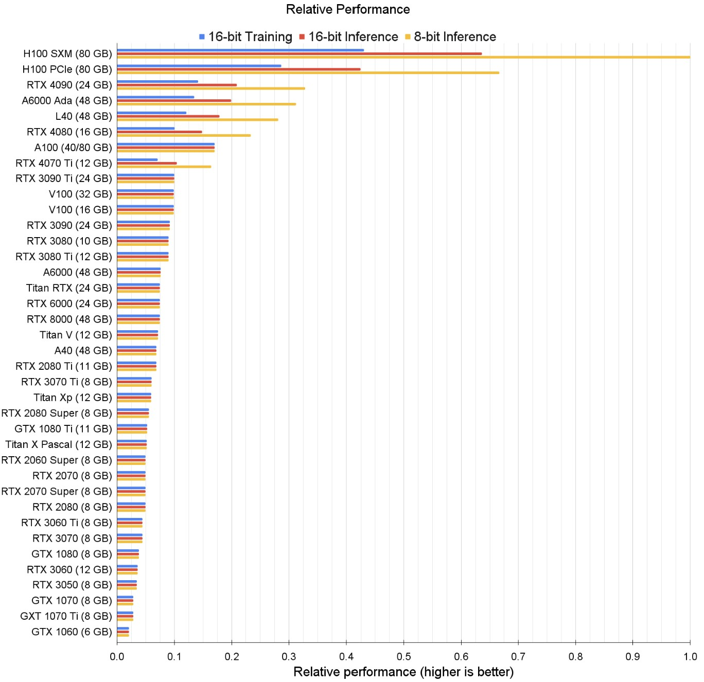
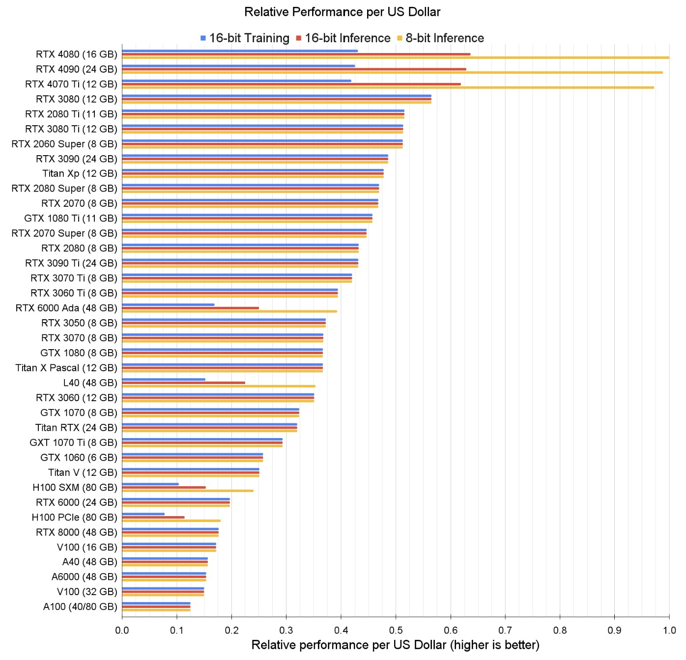

https://timdettmers.com/2023/01/30/which-gpu-for-deep-learning

## GPU Deep Learning Performance per Dollar

While 8-bit inference and training is experimental, it will become standard within 6 months. You might need to do some extra difficult coding to work with 8-bit in the meantime. Is that OK for you? If not, select for 16-bit performance.

The best GPUs for academic and startup servers seem to be A6000 Ada GPUs (not to be confused with A6000 Turing). The H100 SXM GPU is also very cost effective and has high memory and very strong performance. If I would build a small cluster for a company/academic lab, I would use 66-80% A6000 GPUs and 20-33% H100 SXM GPUs. If I get a good deal on L40 GPUs, I would also pick them instead of A6000, so you can always ask for a quote on these.

