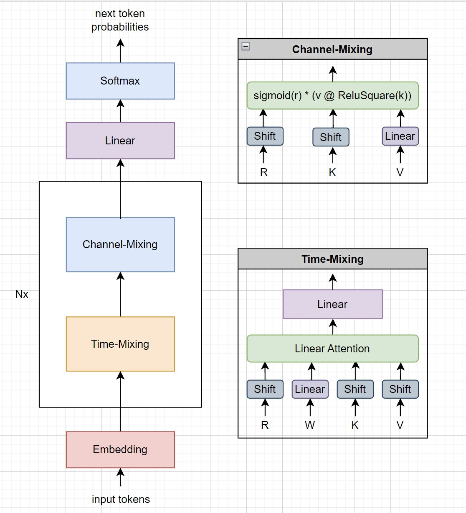

# Khái niệm
- `@` là phép nhân ma trận (vector với ma trận hoặc ma trận với ma trận)
- `*` là phép nhân từng phần tử của vector hoặc ma trận (element-wise product)
- `n_embed` số chiều của vector nhúng (ví dụ 1024)
- `ctx_len` độ dài ngữ cảnh, là độ dài của chuỗi đầu để dự đoán token tiếp theo (ví dụ cần 1024 tokens đầu vào để dự đoán token 1025)
- `token`: một token là một vector đầu vào tại một thời điểm nhất định, token.shape = (n_embed)
- `channel`: kênh thứ k là chuỗi giá trị (scalar) tại một vị trí thứ k của chuỗi vectors (tokens) đầu vào
- `token-shift`: trộn giá trị token thứ i với token trước nó với hệ số 0 < mix < 1: `(i-1) x_i * mix + x_{i-1} * (1 - mix)`
- `time-mixing` trộn giá trị của chuỗi tokens đầu vào với nhau, còn được gọi là attention
- `channel-mixing`: trộn giá trị các kênh của một token với nhau
- `x_i` là giá trị đầu vào của token tại thời điểm i
- `R` là ma trận tham số để tính `r_i = x_i @ R`, R.shape = (n_embed, n_embed)
- `K` là ma trận tham số để tính `k_i = x_i @ K`, K.shape = (n_embed, n_embed)
- `V` là ma trận tham số để tính `v_i = x_i @ V`, V.shape = (n_embed, n_embed)
- `W` là vector tham số để tính time-decay cho từng kênh một, W.shape = (n_embed)
- `time-first` vector giá trị khởi tạo của time_decay tại thời điểm 0, time_first.shape = (n_embed)
- `time-decay`: hệ số phân rã theo thời gian theo từng kênh, thể hiện token càng xa với token đang xét thì có độ ảnh hưởng ít hơn
   - `time-decay_0 = time-first`
   - `time-decay_{n} = (n-1)*W` với n = 1,2,3...
   - `time-decay` của kênh thứ k là `time-first_k, 0, W_k, 2 * W_k, 3 * W_k ...`

Kiến trúc rwkv tương tự như transformer:


Note: khối `shift` bao gồm `token-shift` và `linear`

# Token-shift
Trộn token vector hiện tại với token vector ngay trước nó với một tỉ lệ `0 < time_mix < 1`
```py
xk = x * time_mix_k + prev_x * (1 - time_mix_k)
xv = x * time_mix_v + prev_x * (1 - time_mix_v)
xr = x * time_mix_r + prev_x * (1 - time_mix_r)
```
Xem giải thích chi tiết tại [token-shift.md](./token-shift.md)

# Channel-mixing
```py
def channel_mixing(self, x, state, i:int, time_mix_k, time_mix_r, kw, vw, rw):
    prev_x_idx = 5*i+0
    prev_x = state[prev_x_idx]

    # token-shift with diff mixing factors for k and r
    xk = x * time_mix_k + prev_x * (1 - time_mix_k)
    xr = x * time_mix_r + prev_x * (1 - time_mix_r)
    state[prev_x_idx] = x

    r = torch.sigmoid(rw @ xr) # receptance factor: 0 -> 1
    k = torch.square(torch.relu(kw @ xk)) # square relu, primer paper
    kv = vw @ k
    return r * kv
```

# Time-mixing
Đây là khối quan trọng nhất của mô hình rwkv. Nó thay thế self-attention, và có thể viết lại thành công thức hồi quy. Điều này khiến rwkv vừa là transformer vừa là rnn.

## Công thức linear-attention (hay gpt)


## Viết lại thành rnn

Note: formula (old) là công thức hồi quy chuẩn, formula (new) là công thức cải tiến trong rwkv-4

## Triển khai formula (new) thành code
```py
time_mixing(self, x, state, i:int, time_mix_k, time_mix_v, time_mix_r, time_first, time_decay, kw, vw, rw, ow):
    prev_x_idx = 5*i+1 # attention or time mixing
    prev_x = state[prev_x_idx]
    # token-shift
    xk = x * time_mix_k + prev_x * (1 - time_mix_k)
    xv = x * time_mix_v + prev_x * (1 - time_mix_v)
    xr = x * time_mix_r + prev_x * (1 - time_mix_r)
    state[prev_x_idx] = x # prev_x = x

    r = torch.sigmoid(rw @ xr)
    k = kw @ xk
    v = vw @ xv

    aa = state[5*i+2] # exponential moving average of kv
    bb = state[5*i+3] # exponential moving average of k
    pp = state[5*i+4] # idea: use pp to store exponent of a and b

    ww = time_first + kk # u + k_i
    qq = torch.maximum(pp, ww)
    e1 = torch.exp(pp - qq)
    e2 = torch.exp(ww - qq)
    a = e1 * aa + e2 * vv
    b = e1 * bb + e2

    ww = pp + time_decay
    qq = torch.maximum(ww, kk)
    e1 = torch.exp(ww - qq)
    e2 = torch.exp(kk - qq)
    state[5*i+2] = e1 * aa + e2 * vv
    state[5*i+3] = e1 * bb + e2
    state[5*i+4] = qq

    wkv = a / b
    if   self.FLOAT_MODE == "bf16": wkv = wkv.type(torch.bfloat16)
    elif self.FLOAT_MODE == "fp16": wkv = wkv.half()
    return ow @ (r * wkv)
```
