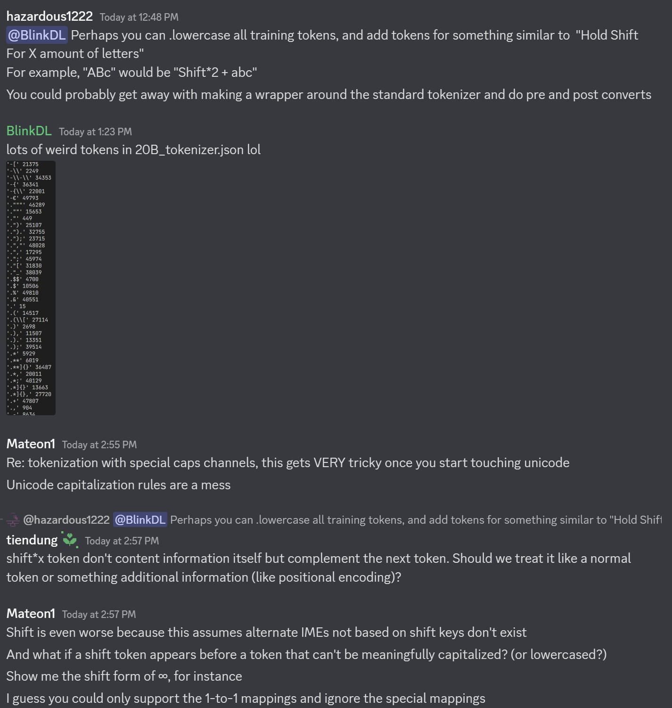
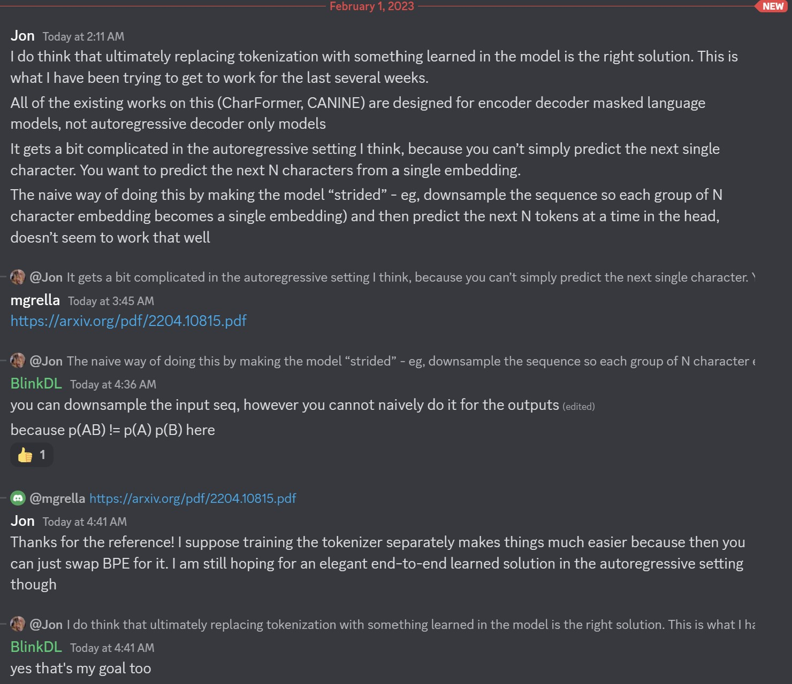
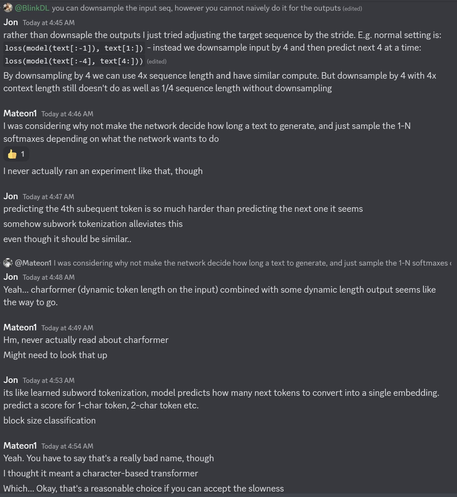

# Để tận dụng một LM tốt nhưng bộ tokenizer lại không support domain phải làm gì?

## averaging of subtokens that are similar to the new added tokens
https://app.slack.com/client/T051JGNCDSR/C056R7ACZJ5/thread/C056R7ACZJ5-1683787313.441939

Giả sử tokenizer nguồn và tokenizer đích được sử dụng trong cùng ngôn ngữ, nhưng có phân phối khác nhau (huấn luyện trên 2 tập dữ liệu khác nhau), do đó chúng là 2 tokenizers là khác nhau. Nhưng các từ (chúng nhìn thấy) giống nhau. **Ví dụ như từ `of`, `and` và `the` giữa hai tokenizer là tương tự về ý nghĩa.**

Đối với một từ bạn muốn thêm vào tokenizer mới, ta **tìm kiếm** các từ (hoặc subwords) trong tokenizer cũ mà cũng có trong tokenizer mới và (có nghĩa) tương tự với từ đó trong không gian nhúng cũ. Sau đó, thực hiện trung bình có trọng số (weighted avg) của các nhúng trong không gian mới.

Bạn có thể nhận được một số kết quả không mong muốn nếu bạn thêm các từ quá ngắn hoặc quá phổ biến vì từ được sử dụng trong tokenizer mới có thể khác nhau. Ví dụ, từ `for` được sử dụng trong `for i in range(100)` nhưng cũng được sử dụng trong `This is for john`.

i think they talked about this in the paper too (below paper)

## Initializing New Word Embeddings for Pretrained Language Models
- https://nlp.stanford.edu/~johnhew/vocab-expansion.html
- Cho thêm tokens của domain vào vocab sẽ giúp finetune tốt hơn
- Cần avg embedding thay vì default init cho new tokens trước khi finetune

## Efficient Domain Adaptation of Language Models via Adaptive Tokenization
- https://arxiv.org/pdf/2109.07460.pdf
- They just change greedy algorithm of BPE to adapt it to the new domain. The vocab is the same.

- - -

https://discord.com/channels/992359628979568762/992359845963497512/1069818939200254003  

Chúng ta có thể hardcode vài kênh để có ý nghĩa. Ví dụ:
- kênh 0 cho token có chứa dấu cách (space)
- kênh 1 cho các token được viết hoa ký tự đầu
- kênh 2 cho các ký tự viết hoa toàn bộ
Khi đó:
- Vector nhúng của ` "abc"` là `[0,0,0,x1,x2,..]`
- Vector nhúng của `" abc"` là `[1,0,0,x1,x2,..]`
- Vector nhúng của `" Abc"` là `[1,1,0,x1,x2,..]`
- Vector nhúng của ` "ABC"` là `[0,0,1,x1,x2,..]`
- ...
Như thế cùng một sym gốc "abc" các token sẽ chia xẻ phần lớn vector nhúng (ví dụ độ dài vector nhúng là 1024 mà chỉ dùng 3 kênh đầu để phân biệt sự khác nhau, còn lại 1021 kênh là có giá trị giống hệt nhau). Và chúng ta có thể __nhanh chóng tính được xác xuất đầu ra của mọi biến thể của "abc"__.

Lưu ý là cách trên giả sử p("Xyz") / p("xyz") là không đổi với mọi "xyz" có thể không đúng. __Cách tốt hơn là định nghĩa emb_space, emb_captialize_first, emb_captialize_all là một hàm của emb__.

Hiện tại tokenizer của chúng ta đang mất quá nhiều items vào việc biểu diễn các biến thể của "abc", " abc", "Abc" ... Hơn thế nữa mô hình không thể phát hiện ra sự giống nhau thực sự nếu một vài biến thể là hiếm gặp trong tập dữ liệu huấn luyện.

- - -

Liên hệ tới text tiếng Việt:

I have same kind of thinking when finding a better way to tokenize Vietnamese text.  In Vietnamese following 15 (typo) variants: "ngùoi, nguòi, nguoì, ngừoi, ngưòi, ngưoì, ngùơi, nguời, nguơì, ngừoi, ngưòi, ngưoì, ngừơi, người, ngươì", are belongs to correct word "người". If we use English-alike BPE there will be a lot of uncessesary tokens that model need to handle since those typos are common in Vietnamese text corpus (in chatting and commenting where people type very fast and no need to be 100% correct). Peng idea remind me that we should consider tokenization seriously, since it done, we cannot have change to fine-tune or fix it. 

Quay trở lại ví dụ trên, dùng symato, sym "nguoi" xuất hiện 15 lần, nghĩa là nó được tập trung biểu diễn, còn các biến thể của nó cũng chỉ gom lại còn là 02 marktones: là f, và wf. Như vậy số lượng tokens giảm đi đáng kể, tập trung biểu diễn cho sym "nguoi" => giúp mô hình chịu lỗi cao hơn và tiết kiệm tài nguyên.

- - -

giả thiết của tớ là mình viết ko dấu rất nhiều trường hợp vẫn đọc được nội dung, chứng tỏ hàm lượng thông tin ở sym là đậm đặc nhất, mình tập trung biểu diễn nó thật tốt trước, sau đó mới tính đến các biến thể viết hoa vs viết thường, + thêm dấu thanh (marktone):
- "Nước Việt Nam hình chữ S => ^ nuoc ws ^ viet zj ^ nam hinh f chu wx ^ s"
- ^ là token thể hiện sym đằng sau nó viết hoa chữ cái đầu, ws, zj, wx là các marktones giống như mình gõ telex mà bỏ dấu thanh ở cuối
- ^ kiểu như là mình phải ấn nút shift trước khi gõ chữ cái muốn viết hoa

- - -

